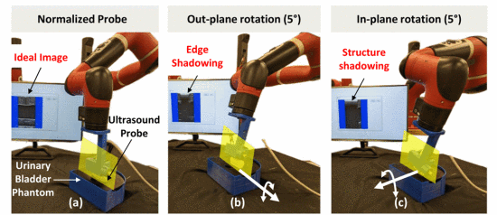
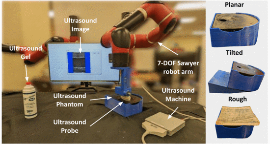
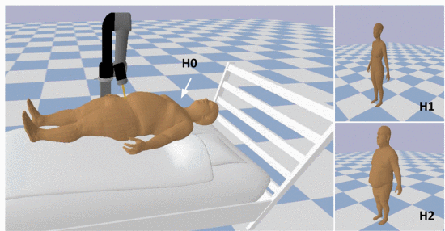
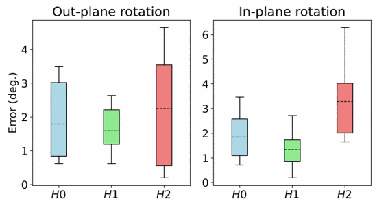

# Assistive Robotic UItrasound

Check out my full paper here: [RUSOpt: Robotic UltraSound Probe Normalization with Bayesian Optimization for In-Plane and Out-Plane Scanning](https://ieeexplore.ieee.org/document/10260479)

This repository presents **RUSOpt**, a robust framework designed to optimize robotic ultrasound probe alignment for enhanced medical imaging. The project addresses the critical challenge of achieving precise probe orientation for both in-plane and out-plane ultrasound scanning, which is vital for diagnostic accuracy in various clinical settings.

Check out the live deployment of the method with a Linear and Curved probe used for scanning on a 3D phantom with in and out of plane scanning using a Sawyer robot arm:

https://github.com/user-attachments/assets/8589619f-c4e2-4680-b7eb-c70db622ac41

    
[Watch the full video here](https://www.youtube.com/embed/xbtTtxrgqpg?si=LPJ7glAaOsSpCTO1)

---

## Introduction

Robotic ultrasound systems hold tremendous potential in medical imaging by offering stable, repeatable, and precise probe control. However, achieving consistent imaging quality across patients remains challenging due to variability in anatomy and probe positioning. RUSOpt introduces an intelligent optimization framework that automatically adjusts probe orientation, ensuring high-quality imaging across diverse scenarios.

**Key Highlights:**
- **In-Plane Scanning**: Aligns the probe to maintain continuous visualization of structures within the imaging plane.
- **Out-Plane Scanning**: Optimizes probe positioning to capture cross-sectional views, expanding diagnostic capability.

This work leverages **Bayesian Optimization (BO)** to systematically refine probe alignment based on imaging quality metrics, enabling fast, accurate adjustments without extensive manual intervention.

---

## Methodology

### Optimization Framework
RUSOpt combines the precision of robotic arms with the intelligence of Bayesian Optimization to enhance ultrasound imaging. Here's how the process works:
1. **Probe Orientation Control**: A robotic arm manipulates the probe with fine-grained control over angles and position.
2. **Quality Assessment**: Imaging quality is evaluated in real-time using metrics such as signal clarity and tissue visibility.
3. **Bayesian Optimization**: Uses an intelligent, iterative approach to explore and refine probe settings. By balancing prior knowledge and experimental data, it efficiently converges to the optimal alignment.

### Why Bayesian Optimization?
Traditional methods like grid search or manual tuning are time-consuming and prone to errors. BO intelligently navigates the search space, making adjustments based on feedback from imaging quality metrics. This ensures faster convergence and better imaging outcomes.

### Experimental Setup
The system was validated on a robotic platform with synthetic and clinical datasets. Experiments included:
- Robustness testing on diverse anatomical models.
- Comparative analysis with conventional optimization techniques.
- Real-world validation with medical experts.

---
## Execution
Here is the deployment of the method in simulation with various body types for generalization:

 

The errors obtained after experimentation were:

  

## Qualitative Impact

RUSOpt provides significant advantages in medical imaging:
- **Consistency**: Reduces variability in imaging quality across patients, leading to more reliable diagnoses.
- **Efficiency**: Minimizes the time and expertise required for probe positioning.
- **Scalability**: Can be integrated into various robotic ultrasound systems for diverse medical applications.

By automating probe alignment, this framework reduces operator dependence and enhances the accessibility of high-quality imaging, particularly in remote or resource-limited settings.

---
