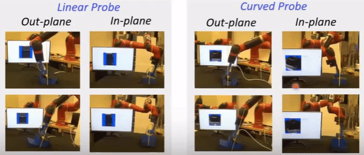

# Robotic Ultrasound Pose Planning with Haptic Force based Estimation

Check out my full paper here: [RUSOpt: Robotic UltraSound Probe Normalization with Bayesian Optimization for In-Plane and Out-Plane Scanning](https://ieeexplore.ieee.org/document/10260479)

This repository presents **RUSOpt**, a robust framework designed to optimize robotic ultrasound probe alignment for enhanced medical imaging. The project addresses the critical challenge of achieving precise probe orientation for both in-plane and out-plane ultrasound scanning, which is vital for diagnostic accuracy in various clinical settings.

Check out the live deployment of the method with a Linear and Curved probe used for scanning on a 3D phantom with in and out of plane scanning using a Sawyer robot arm where it explores the orientation space and aligns with the required normal direction eventually:

    

---

## Introduction

Robotic ultrasound systems hold tremendous potential in medical imaging by offering stable, repeatable, and precise probe control. However, achieving consistent imaging quality across patients remains challenging due to variability in anatomy and probe positioning. RUSOpt introduces an intelligent optimization framework that automatically adjusts probe orientation, ensuring high-quality imaging across diverse scenarios.

### Methodology
- Utilizes force sensor measurements and underlying mechanics to guide the optimization process.
- Incorporates a regularization scheme to handle noisy objective functions.
- Does not require 3D point cloud data of the patient's body.

### Validation
- **Phantom Experiments**: Conducted on urinary bladder phantoms with planar, tilted, and rough surfaces. Tested using both linear and convex probes with varying search space limits.
- **3D Mesh Model Simulations**: Carried out using 3D human mesh models.

### Results

#### Phantom Experiments
- Mean absolute angular error:
  - 2.44 ± 0.7° (linear probe)
  - 2.31 ± 0.7° (convex probe)
- In 78.6% of runs, error was less than 3.0° for linear probe.
- In 76.7% of runs, error was less than 3.0° for convex probe.

#### 3D Mesh Model Simulations
- More than 75% of runs reported an error less than 3.0°.
- Average error for two models (H0 and H1) was less than 3.0°.
- Higher error observed for H3 model due to surface irregularity.

### Advantages
- Sample-efficient compared to previous methods.
- Does not rely on 3D point cloud data or extensive exploration.
- Applicable to both in-plane and out-plane rotations.
## Execution
Here is the deployment of the method in simulation with various body types for generalization:

 

The errors obtained after experimentation were:

  

This shows that the method is accurate and efficient to be used for different patient body types and produce effective orientations for the Ultrasound Probe

## Qualitative Impact

RUSOpt provides significant advantages in medical imaging:
- **Consistency**: Reduces variability in imaging quality across patients, leading to more reliable diagnoses.
- **Efficiency**: Minimizes the time and expertise required for probe positioning.
- **Scalability**: Can be integrated into various robotic ultrasound systems for diverse medical applications.

By automating probe alignment, this framework reduces operator dependence and enhances the accessibility of high-quality imaging, particularly in remote or resource-limited settings.

---
